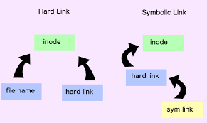

# __Linux Command Line (BASH ─ Bourne Against Shell)__

---

Author: Danilo Matrangolo Marano (danilo.m.marano@gmail.com)

---

## 1.Index

- [1. Index](#1-index)
- [2. Basics](#2-basics)
  - [2.1`whoami`](#21-whoami)
  - [2.2 `pwd`](###-2.2-`pwd`)
  - [2.2 `pwd`](###Archivingfileswith`tar`)

  [Custom foo description](#2foo)


## 2. Basics

### 2.1 `whoami`

It's pretty obvious what it does, indicates the curently user logged in. It's basicaly you asking the system: _Who am I?_ or _What user am I_?

```
dpc@danilo:~$ whoami
dpc

root@danilo:~$ whoami
root
```

### 2.2 `pwd`
This command indicates the curently open path.

### Path Links

A link is a short-cut, in linux we have a hard link and a simbolic link. To understand it we need to know about __inode__: its store all the administration of a file, its metadata. To access the inode we use names, they are links that points directly to the inode's file and are called __hard links__. Now if a link points to the a hard link or the file name instead to it's inode it becomes a __symbolic link__.



The vantage of symbolic links comparing to hard ones are that they can refer to files on another partition and make links of directories.

To visualize some of the information stored in the inode:

```
$ ls -l ../myfile
-rw-rw-r-- 1 dpc dpc 2 Oct 28 19:03 ../myfile
```

The number `1` is the link counter, it counts how many links this file has and the number `2` indicates the size in bytes.

To create a hard link we use the command `ln`:

```
$ ln ../myfile myhardlink
$ ls -l myhardlink
-rw-rw-r-- 2 dpc dpc 2 Oct 28 19:03 myhardlink
```

And to create a symbolic link we use the same previous command with the parameter `ln -s`:

```
$ ln -s ../myfile mysymboliclink
$ ls -l mysymboliclink
lrwxrwxrwx 1 dpc dpc 9 Oct 28 19:09 mysymboliclink -> ../myfile
```

If we move the hard link to another directory nothing happends, but if we made the same thing to a symbolic it will stop working. This is because the hard link shares the same inode from the file and symbolic link is just a path that points to the file. In the code bellow you can notice that the hard link has the same inode index (`11807072`) and size (`2`) of the original file, but the symbolic has a different index (`11807151`) and size (`9`, the length of the path that is pointing to, `../myfile`).

```
$ ls -li ..
11807072 -rw-rw-r-- 2 dpc dpc    2 Oct 28 19:03 myfile

$ ls -li
total 3
11807072 -rw-rw-r-- 2 dpc dpc    2 Oct 28 19:03 myhardlink
11807151 lrwxrwxrwx 1 dpc dpc    9 Oct 28 19:09 mysymboliclink -> ../myfile
```

### Archiving files with `tar`

# 2.Foo
